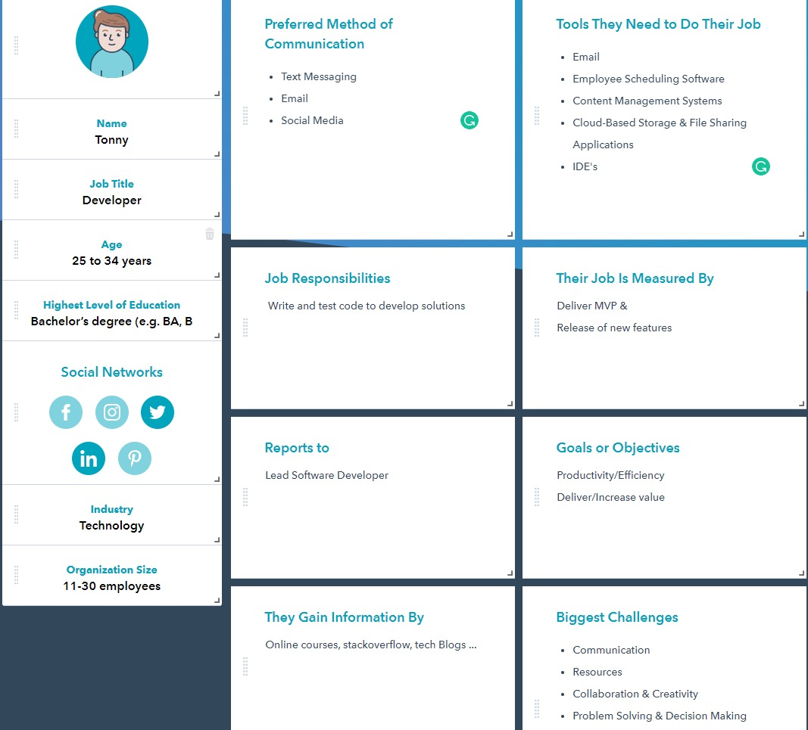
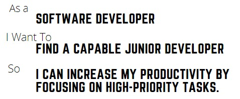
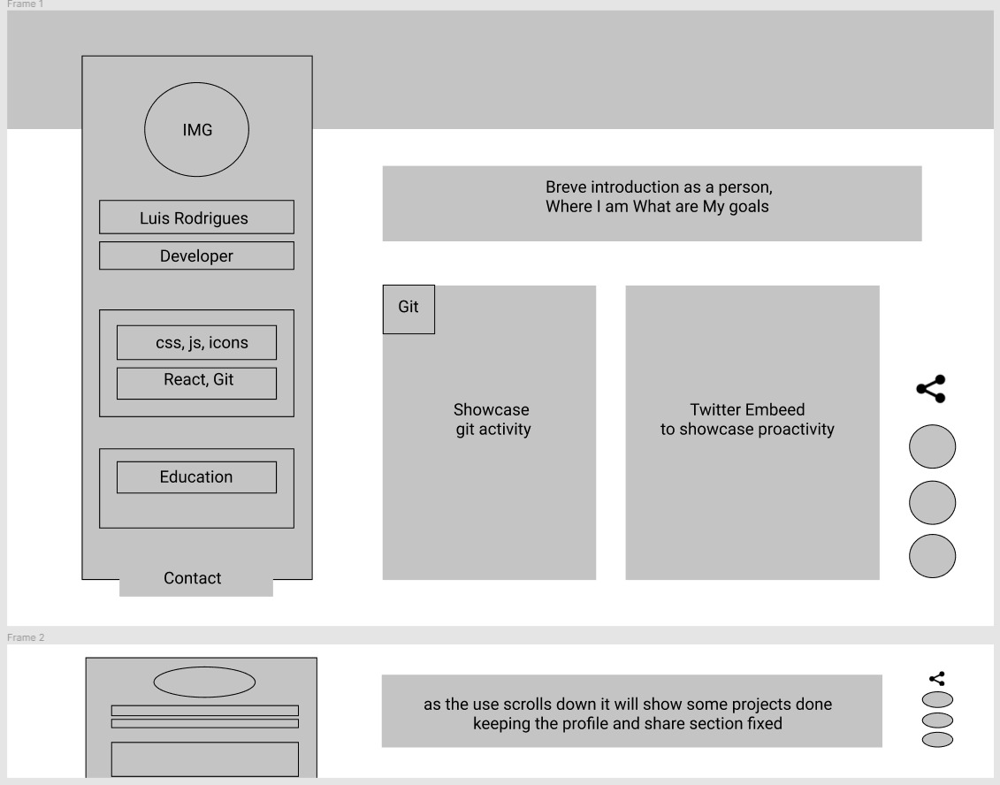
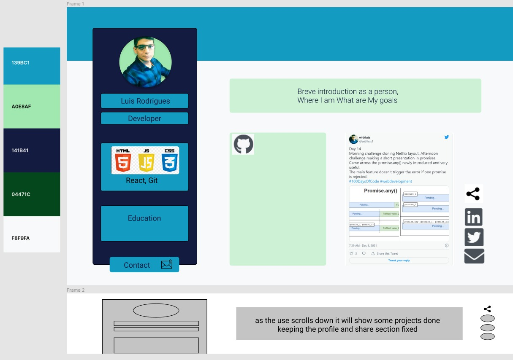

    

<h1 align="center">
  Week 3 - Recap
</h1>

<h1 align="center">
User Persona</h1>

    

<h1 align="center">
User Story</h1>

    

<h1 align="center">
Low Fidelity Design</h1>

    

<h1 align="center">
High Fidelity Design</h1>

    

<h1 align="center">
User Journey</h1>

The recruiter land on the site, identifies the portfolio owner and his role on the top left corner, followed by the short intro about him in the middle of the page. Then his view goes down towards the left side and checks the developer GitHub calendar. From here the recruiter scrolls down and explores the section top projects.

The profile left bar is fixed intentionally so the recruiter doesn't lose the owner's details off sight, and has also a call to action button to contact the developer.

If this portfolio doesn't match the recruiter's needs he can possibly think of someone else to whom this developer could be a good fit so, at the bottom right corner the recruiter has the possibility to share this portfolio through different channels.

